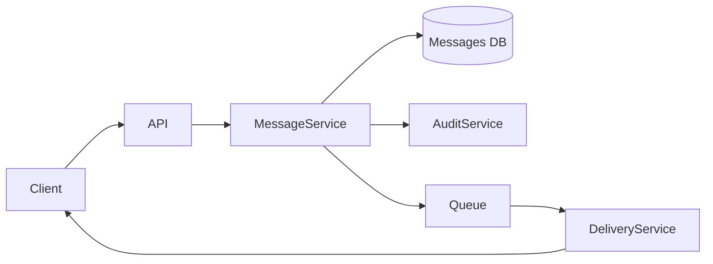
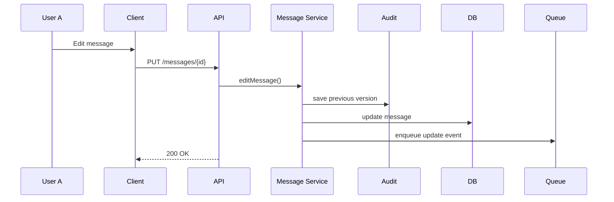
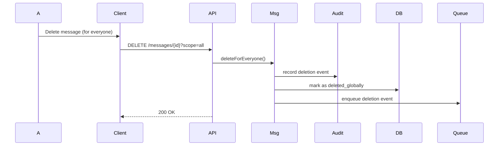
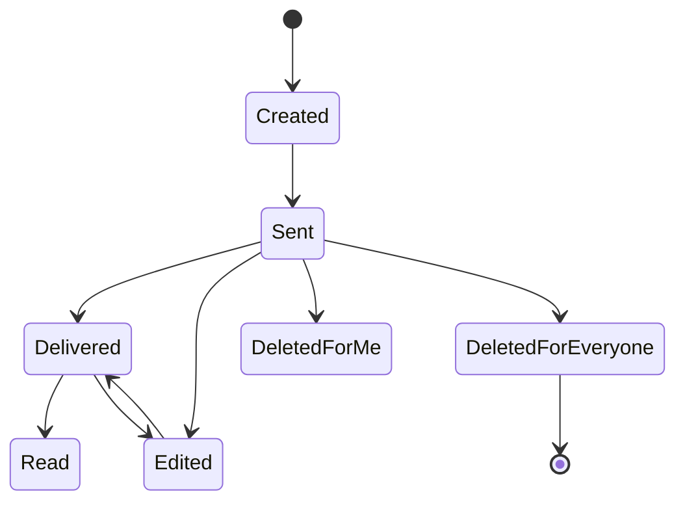

# Lab 1: Variant 5

## Functional Requirements

1. A user can send a message to another user.
2. A message has a lifecycle (created → sent → delivered → read).
3. A user can edit a previously sent message.
4. A user can delete a message:
* Delete for me (local deletion)
* Delete for everyone (global deletion)

5. The system must:
* Store messages persistently
* Deliver them asynchronously
* Track delivery and read status
* Maintain an audit trail of edits and deletions

6. The recipient may be online or offline.

# Part 1 — Component Diagram (30%)
## Components & Responsibilities
1. Client (Web / Mobile)
* Send/edit/delete messages
* Display message status
* Send delivery/read acknowledgments
* Render edit history indicator

2. Backend API
* Authentication & authorization
* Validate edit/delete permissions
* Expose REST endpoints
* Forward requests to Message Service

3. Message Service
* Create messages
* Handle message updates
* Manage deletion logic
* Maintain message state
* Record audit history

4. Audit Service
* Store message versions
* Track who edited/deleted and when
* Provide audit history for compliance

5. Database
* Store messages
* Store message versions
* Store deletion metadata
* Store status information

6. Delivery Mechanism (Queue + WebSocket)
* Asynchronous message delivery
* Handle offline users
* Notify clients about edits/deletions
  
## Component Diagram (Mermaid)

# Part 2 — Sequence Diagram (25%)
## Scenario 1: User A edits a message while User B is offline

When User B reconnects:
* Delivery Service pushes updated message
* Client shows "edited" label

## Scenario 2: Delete "for everyone"

# Part 3 — State Diagram (20%)
## Object: Message

## State Notes
* Edited: content updated, version incremented.
* DeletedForMe: hidden for requesting user only.
* DeletedForEveryone: replaced with "Message deleted".

# Part 4 — RFC
# RFC: Message Editing & Deletion Strategy
## Context
Users can edit or delete messages after sending them.
Recipients may be online or offline at the time of modification.

The system must guarantee:
* Consistency across clients
* Reliable propagation of changes
* Auditability for compliance and debugging

## Problem
1. Should messages be mutable or immutable?
2. How to synchronize edits/deletions for offline users?
3. How to maintain an audit trail without breaking consistency?

## Proposed Solution
### 1. Immutable Core with Versioning
Messages are logically immutable.

Instead of overwriting content:
* Each edit creates a new version.
* The latest version is marked as active.
* Previous versions are stored in MessageHistory.

### 2. Soft Deletion Strategy

* ** Delete for me: **
  * Create a UserMessageVisibility record.
  * Message remains intact for others.
* ** Delete for everyone: **
  * Mark message as deleted_globally = true
  * Replace content with placeholder text.
  * Store deletion event in audit log.

### 3. Asynchronous Update Delivery

All edits and deletions:

Generate events

Are placed in a message queue

Delivered to online users immediately

Delivered to offline users upon reconnection

4. Audit Trail Design

Audit log stores:

Message ID

Previous content

Editor user ID

Timestamp

Operation type (EDIT / DELETE_LOCAL / DELETE_GLOBAL)

Audit data is append-only.

Alternatives Considered
1. Fully Mutable Messages (Rejected)

Overwriting message content destroys history and reduces auditability.

2. Hard Delete from Database (Rejected)

Breaks conversation consistency and may violate compliance requirements.

3. Client-Side Only Deletion (Rejected)

Not secure or reliable.

Consequences
Positive

Strong consistency

Full auditability

Reliable offline support

Compliance-friendly design

Negative

Increased storage usage

More complex logic

Additional infrastructure (queue + audit storage)

📚 Part 5 — ADR
ADR-001: Use Versioned Immutable Messages
Status

Accepted

Context

Message editing requires preserving history while maintaining consistency across distributed clients.

Decision

Messages will be implemented as:

Immutable records

Edits create new versions

Deletions are soft (state-based)

All changes recorded in an append-only audit log

Consequences
Advantages

Full traceability

Safe concurrent updates

Easy debugging

Supports regulatory compliance

Trade-offs

More database storage

Additional versioning logic

More complex queries

✅ Final Design Principles

Event-driven architecture

Asynchronous delivery

Immutable data + versioning

Soft deletion instead of hard deletion

Append-only audit log

Eventual consistency with guaranteed reliability

